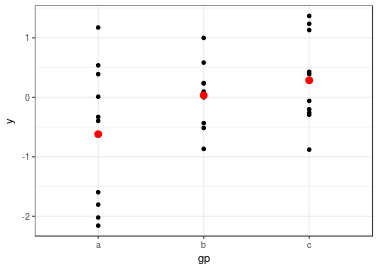
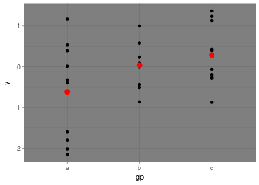

<!-- DO NOT EDIT README.md. It is created by README.Rmd -->


# ggrittr


The ggrittr package is intended to provide a proxy for each layer of the ggplot to enable magrittr piping of each layer. Often when you are working back and forth between data and visualization, it is easy to substitute the pipes for plusses and vice-versa. 

## Installing ggrittr


```r
devtools::install_git("https://github.com/DariusTG/ggrittr.git")
```

## Using ggrittr
Here is an example using ggplot man page examples (with some modification)

```r
library(magrittr)
library(ggplot2)
library(ggrittr)
library(dplyr)


df = data.frame(
  gp = factor(rep(letters[1:3], each = 10)),
  y = rnorm(30)
)
ds = plyr::ddply(df, "gp", plyr::summarise, mean = mean(y), sd = sd(y))

# The summary data frame ds is used to plot larger red points on top
# of the raw data. Note that we don't need to supply `data` or `mapping`
# in each layer because the defaults from ggplot() are used.
ggplot(df, aes(gp, y)) %>%
  geom_point_p() %>%
  geom_point_p(data = ds, aes(y = mean), colour = 'red', size = 3) %>%
  theme_bw_p()
```




```r
# Same plot as above, declaring only the data frame in ggplot().
# Note how the x and y aesthetics must now be declared in
# each geom_point() layer.
ggplot(df) %>%
  geom_point_p(aes(gp, y)) %>%
  geom_point_p(data = ds, aes(gp, mean), colour = 'red', size = 3) %>%
  theme_dark_p()
```




```r
# Alternatively we can fully specify the plot in each layer. This
# is not useful here, but can be more clear when working with complex
# mult-dataset graphics
ggplot() %>%
  geom_point_p(data = df, aes(gp, y)) %>%
  geom_point_p(data = ds, aes(gp, mean), colour = 'red', size = 3) %>%
  geom_errorbar_p(
    data = ds,
    aes(gp, mean, ymin = mean - sd, ymax = mean + sd),
    colour = 'red',
    width = 0.4
  ) %>%
  theme_linedraw_p()
```


